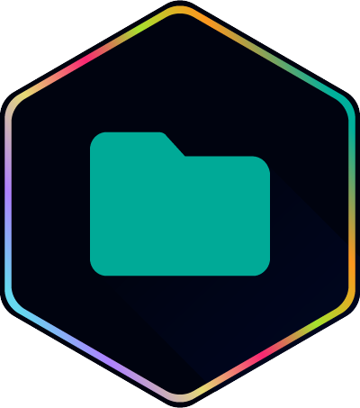

<div align="center">
    

<h1>Hadar Icons</h1>

<p>El tema de iconos definitivo para el desarrollo moderno. Inspirado en la energía de Beta Centauri, Hadar Icons fusiona claridad visual con una estética vibrante para iluminar tu código y acelerar tu flujo de trabajo.</p>

<p>
    <a href="https://marketplace.visualstudio.com/items?itemName=cristianvasquez.hadar-icons">
      
    </a>
    <a href="https://marketplace.visualstudio.com/items?itemName=cristianvasquez.hadar-icons">
    
    </a>
    <a href="https://marketplace.visualstudio.com/items?itemName=cristianvasquez.hadar-icons">
      
    </a>
    <a href="https://github.com/cristianvasquezc/hadar-icons-vscode/blob/main/LICENSE">
      
    </a>
</p>

  <a href="https://hadartheme.netlify.app/">
    
  </a>
</div>

<br/>


## ✨ Características

- **Jerarquía Visual Vibrante**: Colores y formas elegidos para distinguir tipos de archivos al instante.
- **Packs Especializados por Framework**: Sets de iconos dedicados para tus stacks favoritos:
  - **Angular** (Componentes, Directivas, Pipes, Resolvers)
  - **NestJS** (Módulos, Controladores, Servicios)
  - **React & Redux** (`.jsx`, `.tsx`, Reducers, Actions, Stores)
  - **Vue & Vuex** (`.vue`, Stores, Configuración de Vue)
  - **NgRx** (Actions, Effects, Reducers, Selectors)
- **Colores de Carpeta Personalizables**: Combina con tu estado de ánimo o identidad del proyecto.
  - Elige entre preajustes: **Mint**, **Cherry**, **Golden**, **Lime**.
  - **Color Hex Personalizado**: ¡Usa cualquier color que quieras!
- **Configuración Inteligente**: Cambia sin problemas entre packs de iconos sin recargar ni estropear tu configuración.
- **Control de Flechas del Explorador**: Muestra u oculta las flechas del explorador para una apariencia más limpia.

## ⚡ Comandos Rápidos

Optimiza tu flujo de trabajo con estos comandos esenciales. Accede a ellos vía `Ctrl+Shift+P` y escribe `Hadar`.

| Comando                  | Acción                     | Detalles                                                                   |
| :----------------------- | :------------------------- | :------------------------------------------------------------------------- |
| `Activate Theme`         | **Activar Tema**           | Aplica Hadar Icons como tu tema activo.                                    |
| `Change Folder Color`    | **Personalizar Carpetas**  | Elige entre presets (Mint, Cherry...) o usa tu propio Hex.                 |
| `Configure Icon Packs`   | **Configurar Framework**   | Adapta los iconos a tu stack (Angular, NestJS, React...).                  |
| `Toggle Explorer Arrows` | **Flechas del Explorador** | Alterna la visibilidad de las flechas de carpeta para un look minimalista. |

## 🚀 Uso

### Activar el Tema

1.  Abre la **Paleta de Comandos** (`Ctrl+Shift+P` / `Cmd+Shift+P`).
2.  Ejecuta `Preferences: File Icon Theme` (Preferencias: Tema de Iconos de Archivo).
3.  Selecciona **Hadar Icons**.

### 🎨 Personalizar Colores de Carpetas

¿Quieres un estilo diferente? Cambia los colores de las carpetas al instante:

1.  Abre la Paleta de Comandos.
2.  Ejecuta `Hadar Icons: Change Folder Color`.
3.  Elige un preajuste o introduce tu propio **Código Hex** (ej. `#FF00FF`).

### 🛠 Configurar Packs de Iconos

¿Trabajando en un framework específico? Optimiza tus iconos:

1.  Abre la Paleta de Comandos.
2.  Ejecuta `Hadar Icons: Configure Icon Packs`.
3.  Elige tu stack (ej. `React + Redux`, `NestJS`, `Angular + NgRx`).

Alternativamente, configúralo en tu `settings.json`:

```json
"hadar-icons.activeIconPack": "nestjs"
```

Opciones disponibles: `default`, `angular`, `angular_ngrx`, `nestjs`, `react`, `react_redux`, `vue`, `vue_vuex`.

### 📂 Alternar Flechas del Explorador

¿Prefieres una apariencia minimalista?

1.  Abre la Paleta de Comandos.
2.  Ejecuta `Hadar Icons: Toggle Explorer Arrows`.

<p align="center">
    Hecho con ❤️ por <a href="https://mislinks.netlify.app/">Cristian Vásquez</a>
</p>
